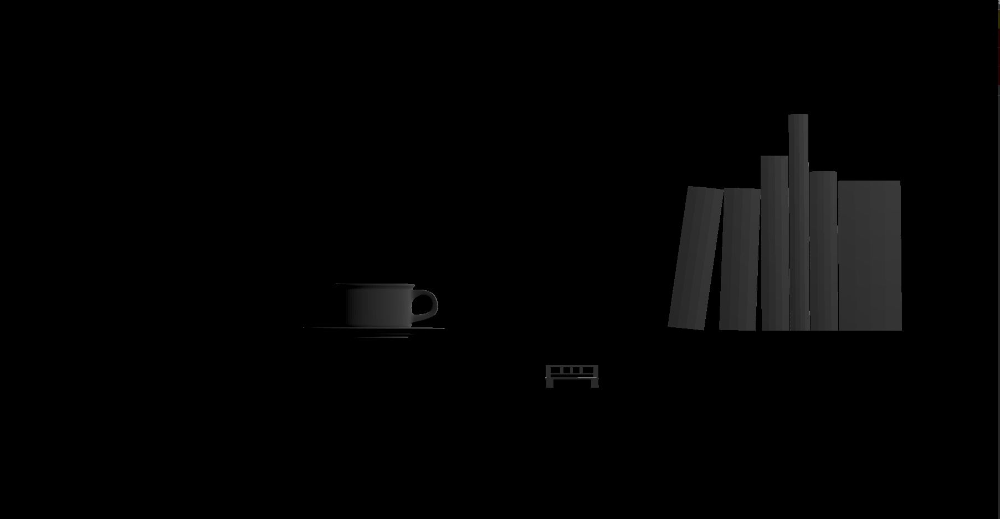

# CMPM163Labs

lab 2 - 
link to video:
https://drive.google.com/file/d/1TJrb531qbUYs8vfD9Jt87cmD0bMApURK/view?usp=sharing

lab 3 -
link to video:
https://drive.google.com/file/d/1_Tlb3k_zGCBZ6box8ST1XJiVZ3zvoBvy/view?usp=sharing

Cube Descriptions:
Middle Cube: Basic cube created using Phong model specular lighting and Three.js materials
Bottom Left Cube: Cube with modified clearcoat using Phong model specular lighting and Three.js mateirals
Right Cube: Cube created with shaders which uses color interpolation. 
Top Left Cube: Cube created with shaders and modified colors and color interpolation to appear paler and smoother
